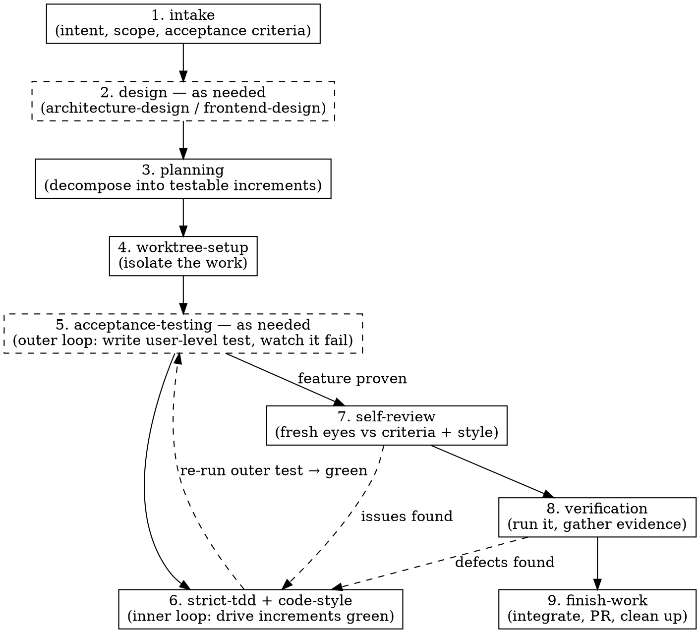

# Dev Workflow — the disciplined pipeline

## What this is

Every change to production code — a feature, a bugfix, a refactor, a "tiny" tweak — flows through one pipeline. This skill is the conductor. It doesn't do the work itself; it decides which phase you're in, enforces the gate for that phase, and hands off to the specialist skill that does the work.

The reason for a single enforced path is simple: the failures that cost the most — building the wrong thing, untested code, style drift, regressions — all come from skipping a phase because it "felt unnecessary this time." The pipeline removes that decision. There is no fast lane, because the fast lane is where the bugs live.

**What this pipeline is *not* for:** work that changes no product behavior. Updating dependency or tooling versions, lockfiles, and config drift go through `dependency-maintenance`, a lighter sibling lane — not this pipeline. And when a defect's cause is unknown, `systematic-debugging` finds it first, then feeds the fix back into this pipeline. Both are covered below under "When phases send you backward" and the maintenance lane.

## The pipeline

Each phase has a dedicated skill: `intake`, `architecture-design` / `frontend-design`, `planning`, `worktree-setup`, `acceptance-testing`, `strict-tdd`, `code-style`, `self-review`, `verification`, `finish-work`. Dispatch and parallelism are handled by `subagent-execution`.

**Design (phase 2) is conditional.** Run it when the change adds new structure or a user-facing surface: `architecture-design` when there are new moving parts (a module, integration, persistence/transport concern, non-trivial structural refactor), `frontend-design` when a user sees or does something new. Both can run — a full-stack feature needs each. Skip design entirely for a change that fits cleanly into existing, well-shaped structure with no UI. When in doubt, a two-line design note ("fits existing checkout feature, one new command handler") is cheap; a wrong structure discovered mid-TDD is not.

**Acceptance testing (phase 5) is the outer loop, and conditional.** For a user-facing feature or a change to a user flow, write a user-level acceptance test up front — against a production-like deployment (real UI + API, real database in a container, external deployed fakes, never code-level doubles) — and watch it fail. It stays red while the inner `strict-tdd` increments (phase 6) are built, and its going green is what proves the feature works end to end. Skip it for a pure internal refactor already covered by the existing acceptance suite. This is double-loop TDD: the outer acceptance test brackets the inner unit cycle.

## The gate you must honor

<HARD-GATE>
Do NOT write or edit production code until BOTH of these exist:
1. Agreed acceptance criteria (from `intake`)
2. A written plan of testable increments (from `planning`)

If you are asked to "just quickly" change code and these do not exist, stop and start at phase 1. "Simple" changes are exactly where unexamined assumptions cause the most rework.
</HARD-GATE>

This is not bureaucracy for its own sake. Intake catches "we built the wrong thing." Planning catches "we painted ourselves into a corner." Skipping them doesn't save time; it moves the cost later, where it's larger.

## How to run it

At the start of any development request, **state the current phase out loud** and confirm its precondition before acting. For example: *"This is a new feature. No acceptance criteria exist yet — starting at phase 1, intake."* This single habit is what makes the gate real instead of decorative.

On a repo craft hasn't run in before, make sure a `.craft.yml` exists first — it tells every downstream phase how *this* project runs its tests, app, and acceptance environment. If it's missing, use `project-conventions` to bootstrap one before the phases that need those commands (TDD, acceptance, verification).

Then, for each phase:

1. Announce which phase you're entering and why.
2. Invoke the phase's skill and follow it.
3. Confirm the phase's exit condition is met before advancing.

Track the work item's progress with a task list — one task per phase — so the state is always visible and a resumed session knows exactly where it left off.

### Phase map

| Phase | Skill | Precondition (gate) | Exit condition |
|-------|-------|---------------------|----------------|
| 1 | `intake` | A change is requested | Acceptance criteria agreed; bugs have a reproduction |
| 2 | `architecture-design` / `frontend-design` *(as needed)* | Criteria exist; change adds structure or UI | Design note: boundaries/ports/handlers and/or components/states |
| 3 | `planning` | Criteria (and design, if any) exist | Ordered increments written, independence marked |
| 4 | `worktree-setup` | Plan exists | Isolated worktree + branch created |
| 5 | `acceptance-testing` *(as needed — outer loop)* | User-facing feature or user-flow change | User-level acceptance test written, watched failing against a production-like deployment |
| 6 | `strict-tdd` + `code-style` | Inside the worktree | Every increment green; committed at green + after refactor; outer acceptance test now green |
| 7 | `self-review` | Increments implemented | Diff reviewed against criteria, style, smells |
| 8 | `verification` | Review passed | The change actually ran (incl. the acceptance suite); evidence captured |
| 9 | `finish-work` | Verified | Integrated (PR/merge), worktree cleaned up |

## Speeding it up with subagents

Phases 5–8 are the slow part, and much of it parallelizes. The orchestrator's job is to dispatch aggressively **without breaking the discipline**:

- **The front of the pipeline runs as focused agents.** Dispatch a `craft-planner` for intake + planning; when the change adds structure, a `craft-architect` for `architecture-design`; when it's user-facing, a `craft-designer` for `frontend-design`. Architecture and UI design touch disjoint concerns, so for a full-stack feature they can run in parallel, then feed the planner.
- **The outer acceptance loop runs alongside the inner work.** For a user-facing feature, dispatch a `craft-acceptance-tester` to write the user-level acceptance tests up front (left failing) and stand up the production-like environment. It works in parallel with the implementers — they drive the inner unit loop while its outer test is the shared red target — and it confirms green once the increments land.
- **Independent increments run in parallel.** If `planning` marked two increments as touching disjoint files, dispatch each to its own `craft-implementer` (each in a sibling worktree, each running the full strict-TDD + code-style loop). Increments with dependencies run in order. When they finish, a `craft-reconciler` merges the increment branches back into the work-item branch — clean by construction, or a flagged planning defect if two collide.
- **Review and verification run as fresh-eyes agents.** Hand the diff to a `craft-reviewer` and a `craft-verifier` that did *not* write the code. A reviewer without implementation bias catches more — this is a quality win, not only a speed one.
- **Unknown-cause defects go to the debugger first.** When `self-review` or `verification` finds a defect whose cause isn't obvious, dispatch a `craft-debugger` to find the root cause (reproduce, narrow, confirm) before the fix returns to a `craft-implementer` to capture as a failing test.

The `craft` plugin ships nine agents — `craft-planner`, `craft-architect`, `craft-designer`, `craft-acceptance-tester`, `craft-implementer`, `craft-reconciler`, `craft-reviewer`, `craft-verifier`, `craft-debugger` — covering the pipeline end to end. `subagent-execution` covers exactly what each needs and how to reconcile their output.

See `subagent-execution` for exactly how to parcel the work, what context each subagent needs, and how to reconcile their results. The rule that never bends: parallelism is allowed only where the work is genuinely independent. Two subagents editing the same file is not speed, it's a merge conflict waiting to corrupt the discipline.

## When phases send you backward

The dashed arrows are normal, not failures. If `self-review` or `verification` finds a defect, you return to `strict-tdd`: write a failing test that reproduces the defect, then fix it. You never patch a defect without a test that would have caught it — that's how the pipeline stays a ratchet that only tightens.

When the defect's cause isn't obvious — a failure you can't yet explain, a flaky test, a regression, a race — don't guess your way back through `strict-tdd`. Use `systematic-debugging` first to find the root cause (reproduce, narrow, confirm one hypothesis at a time), then hand the confirmed cause to `strict-tdd` to capture as a failing test and fix. Debugging finds the cause; the pipeline captures and fixes it.

## Rationalizations to reject

| Thought | Reality |
|---------|---------|
| "This change is too small for the pipeline" | Small changes skip gates precisely because they look safe. The gate is cheap; the missed assumption is not. |
| "I already know what to build, skip intake" | Then intake takes 30 seconds. Writing it down is what surfaces the disagreement you didn't know you had. |
| "Let me just prototype in the main tree" | Exploration is fine — in a worktree, thrown away after. Prototyping in place is how prototypes ship untested. |
| "One worktree is overkill for a one-liner" | The worktree costs seconds and keeps main clean. The one-liner that broke main also looked harmless. |
| "Subagents are slower to set up than just doing it" | For a single increment, maybe. For independent increments or for a fresh-eyes review, they're both faster and better. |
