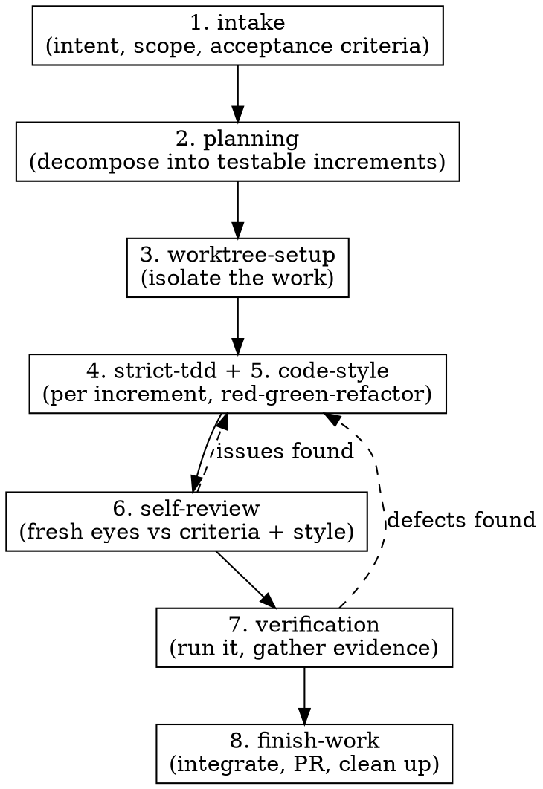

# Dev Workflow — the disciplined pipeline

## What this is

Every change to production code — a feature, a bugfix, a refactor, a "tiny" tweak — flows through one pipeline. This skill is the conductor. It doesn't do the work itself; it decides which phase you're in, enforces the gate for that phase, and hands off to the specialist skill that does the work.

The reason for a single enforced path is simple: the failures that cost the most — building the wrong thing, untested code, style drift, regressions — all come from skipping a phase because it "felt unnecessary this time." The pipeline removes that decision. There is no fast lane, because the fast lane is where the bugs live.

## The pipeline

Each numbered phase has a dedicated skill: `intake`, `planning`, `worktree-setup`, `strict-tdd`, `code-style`, `self-review`, `verification`, `finish-work`. Dispatch and parallelism are handled by `subagent-execution`.

## The gate you must honor

<HARD-GATE>
Do NOT write or edit production code until BOTH of these exist:
1. Agreed acceptance criteria (from `intake`)
2. A written plan of testable increments (from `planning`)

If you are asked to "just quickly" change code and these do not exist, stop and start at phase 1. "Simple" changes are exactly where unexamined assumptions cause the most rework.
</HARD-GATE>

This is not bureaucracy for its own sake. Intake catches "we built the wrong thing." Planning catches "we painted ourselves into a corner." Skipping them doesn't save time; it moves the cost later, where it's larger.

## How to run it

At the start of any development request, **state the current phase out loud** and confirm its precondition before acting. For example: *"This is a new feature. No acceptance criteria exist yet — starting at phase 1, intake."* This single habit is what makes the gate real instead of decorative.

Then, for each phase:

1. Announce which phase you're entering and why.
2. Invoke the phase's skill and follow it.
3. Confirm the phase's exit condition is met before advancing.

Track the work item's progress with a task list — one task per phase — so the state is always visible and a resumed session knows exactly where it left off.

### Phase map

| Phase | Skill | Precondition (gate) | Exit condition |
|-------|-------|---------------------|----------------|
| 1 | `intake` | A change is requested | Acceptance criteria agreed; bugs have a reproduction |
| 2 | `planning` | Criteria exist | Ordered increments written, independence marked |
| 3 | `worktree-setup` | Plan exists | Isolated worktree + branch created |
| 4 | `strict-tdd` + `code-style` | Inside the worktree | Every increment green; committed at green + after refactor |
| 5 | `self-review` | Increments implemented | Diff reviewed against criteria, style, smells |
| 6 | `verification` | Review passed | The change actually ran; evidence captured |
| 7 | `finish-work` | Verified | Integrated (PR/merge), worktree cleaned up |

## Speeding it up with subagents

Phases 4–7 are the slow part, and much of it parallelizes. The orchestrator's job is to dispatch aggressively **without breaking the discipline**:

- **Independent increments run in parallel.** If `planning` marked two increments as touching disjoint files, dispatch each to its own implementer subagent (each in a sibling worktree, each running the full strict-TDD + code-style loop). Increments with dependencies run in order.
- **Review and verification run as fresh-eyes subagents.** Hand the diff to a `self-review` subagent and a `verification` subagent that did *not* write the code. A reviewer without implementation bias catches more — this is a quality win, not only a speed one.

See `subagent-execution` for exactly how to parcel the work, what context each subagent needs, and how to reconcile their results. The rule that never bends: parallelism is allowed only where the work is genuinely independent. Two subagents editing the same file is not speed, it's a merge conflict waiting to corrupt the discipline.

## When phases send you backward

The dashed arrows are normal, not failures. If `self-review` or `verification` finds a defect, you return to `strict-tdd`: write a failing test that reproduces the defect, then fix it. You never patch a defect without a test that would have caught it — that's how the pipeline stays a ratchet that only tightens.

## Rationalizations to reject

| Thought | Reality |
|---------|---------|
| "This change is too small for the pipeline" | Small changes skip gates precisely because they look safe. The gate is cheap; the missed assumption is not. |
| "I already know what to build, skip intake" | Then intake takes 30 seconds. Writing it down is what surfaces the disagreement you didn't know you had. |
| "Let me just prototype in the main tree" | Exploration is fine — in a worktree, thrown away after. Prototyping in place is how prototypes ship untested. |
| "One worktree is overkill for a one-liner" | The worktree costs seconds and keeps main clean. The one-liner that broke main also looked harmless. |
| "Subagents are slower to set up than just doing it" | For a single increment, maybe. For independent increments or for a fresh-eyes review, they're both faster and better. |
